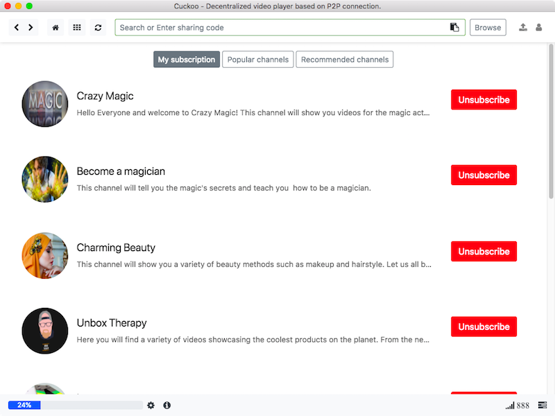
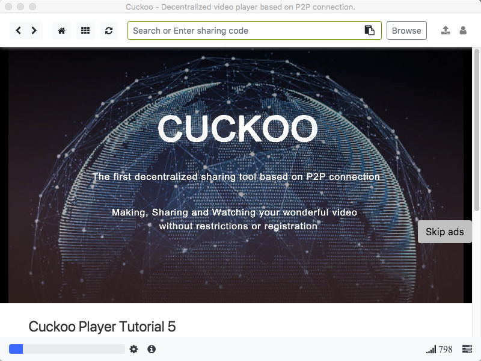

# Cuckoo

> Decentralized video player based on P2P connection.
> 

## About Cuckoo. 

Cuckoo is a decentralized video player based on P2P connection.Cuckoo is free and always will be.Anyone or group can search, make, share and watch your favorite videos in Cuckoo without any limits or registration.

|               Index               |              List               |               Player                |
| :-------------------------------: | :-----------------------------: | :---------------------------------: |
|  |  |  |

Any resources stored in Cuckoo, including text, images, sounds, videos and website code, will generate an unique address after hashing and you can play and share videos just by this code in Cuckoo which is totally anonymous. As the P2P connection, the more you subscribe and use Cuckoo, the faster it will be.

Because of the protection of the encryption algorithm and P2P connection, every channel's address in Cuckoo has the characteristics of being tamper-resistant and cannot be deleted (in a sense, if the password is cracked, it may be tampered with or deleted, but the probability is extremely low). So, once the video or data is stored in Cuckoo, it will be permanent.

The users, companies and founders in Cuckoo will look different than they have in the past because Cuckoo is more decentralized, more freedom and more globally connected. By video funding and sharing,building the future of rights managerment and P2P distribution,every video and channel will be easily controlled, shared and managed by the Cuckoo users from development to distribution.

Cuckoo believes decentralization holds the key to your freedom and it is the best way to protect your privacy. In decentralized Cuckoo, we record, share and deliver every important moment in the way which is the future of your work and life. You will find yourself flying like a cuckoo in a free world.

## Donate Cuckoo

Donate to support Cuckoo's development. All donation will be used to build a more decentralized, more globally accessible, more free and more trustworthy Cuckoo.

bitcoin:3FcucBgqCbqk2SJp9AaqgFN7FCKjtp3S1q

litecoin:MKD16vSwo4nWLhjcncZEorqH6b3JQ5GspV
